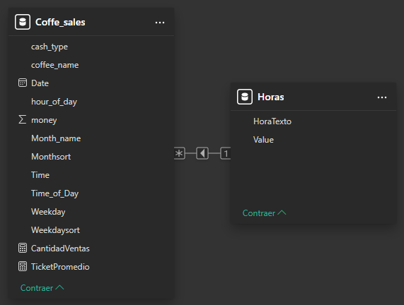

# ☕ Coffee Sales Dashboard

## 🧩 Tema general
Análisis de ventas de café en una cafetería.

---

## 🎯 Objetivo principal
Identificar patrones de venta por tipo de producto, horario y método de pago, con el fin de comprender el comportamiento de los clientes y optimizar las operaciones comerciales.

---

## ❓ Preguntas clave
- ¿Cuál es el café más vendido?  
- ¿En qué horarios y días se realizan la mayor cantidad de ventas?  
- ¿Cuál es el método de pago más utilizado?  
- ¿Influye el precio del producto en las ventas?  

---

## 📈 Visualizaciones previstas
- **Gráfico de barras:** ventas por tipo de café  
- **Gráfico de líneas:** ventas por hora  
- **Tarjetas KPI:** total de ventas, cantidad de transacciones, ticket promedio  
- **Gráfico de dona:** distribución por método de pago  

---

## 💡 Insights a buscar
- Identificar los momentos de mayor demanda.  
- Determinar el producto más rentable.  
- Analizar la relación entre horario y ticket promedio.  

---

## 🧰 Tecnologías utilizadas
- **Power BI** – Visualización de datos y diseño del dashboard  
- **Excel / CSV** – Limpieza y preparación de datos  
- **SQL** – Exploración y consulta de información  
- **GitHub** – Documentación y publicación del proyecto  

---

## 🗺️ Modelo de Datos

El modelo de datos consta de dos tablas relacionadas:  
- **Horas** (dimensión temporal)  
- **Coffee_sales** (transacciones)

---

## 📊 Resultados esperados
El dashboard final busca ofrecer una visión integral del comportamiento de ventas, facilitando la toma de decisiones estratégicas y la identificación de oportunidades de mejora.

---

👨‍💻 **Autor:** [Franco Britez](https://www.linkedin.com/in/francojbritez/)  
📂 **Repositorio:** [Portfolio_Data_Analyst](https://github.com/francojbritez/Portfolio_Data_Analyst)
